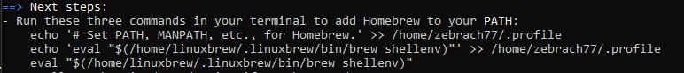

## BinanceLogger
## Описание
Данная программа подключается по websocket к криптобирже Binance и выводит оттуда в режиме реального времени котировки BTC/USDT.

Параллельно (Bid+Offer(Ask))/2 для значений price и qty соответственно пишутся в data_log.txt, а также программа ведёт логи подключения в connection_log.txt.

После запуска собранной программы достаточно ввести в консоль "r" и нажать "Enter" - данные начнут выводиться.

Для остановки введите "s" и нажмите "Enter". Может потребоваться проделать эти действия несколько раз.
### Инструкция по установке
[1] Установка необходимых библиотек
```
sudo apt-get update
sudo apt-get install git
sudo apt-get install libssl-dev
sudo apt-get install cmake
sudo apt-get install build-essential
sudo apt-get install curl
```

[2] Установка homebrew*
```
/bin/bash -c "$(curl -fsSL https://raw.githubusercontent.com/Homebrew/install/HEAD/install.sh)"
```

После окончания установки выполните команды из вывода под "next steps"


* Для корректной работы BinanceLogger необходима библиотека boost версии 1.75 и выше. В репозиториях APT, которые использует команда apt install, хранится boost максимальной версии 1.74.
Поэтому для установки boost был выбран инструмент homebrew, который устанавливает boost нужной версии.

[3] Установка boost
```
brew install boost
```


[4.1] Сборка проекта
```
cmake .
make
```

[4.1] Сборка проекта, если он ещё не скачан, при помощи git
```
git clone https://github.com/zebrach77/BinanceLogger.git
cd BinanceLogger
cmake .
make
```

[4.2] Сборка проекта, если он скачан в zip архиве
```
sudo apt-get install unzip
mkdir BinanceLogger
unzip {имя архива} -d BinanceLogger
cd BinanceLogger
cmake .
make
```

[5] Запуск
```
./BinanceLogger
```


[6] Удаление всех созданных объектных файлов
```
sudo chmod -R 777 delete_script
./delete_script
```

Логи подключения пишутся в connection_log.txt


Логи данных пишутся в data_log.txt

